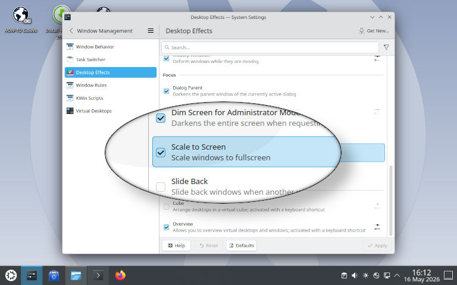

# Scale to Screen – A KWin effect to scale windows (e.g. games) to fullscreen 
**Scale to Screen** is a **KWin 6 effect** (written against KDE 6.6) that scales the active window to fullscreen. It's probaby most comparable to **magpie** on Windows or some kind of **poor-man's gamescope**. This is simply the first little project that came to mind when I decided to learn about the KWin internals and while it certainly might have its bugs and limits (read how it works and the bugs and issues below), it's actually working rather well at least for my purposes. If you need a quick-and-easy window up/down-scaler or if you're in the same situation as me and have older CPUs/GPUs with no or incomplete Vulkan support, just give it a try. Gamescope doesn't run on these at all. My reference platform here is my trusty old 14 years old Celeron N2840 7.5 Watts CPU, which can actually run Crysis through wine's D3D to OpenGL layer (it's playable at 800x500 with lowest settings :-)).

## Disclaimer
Please be aware that this plugin **might cause crashes**. As I wrote in the introduction, I'm completely new to the KWin-codebase and have to rely pretty much only on the headers to figure stuff out. Documentation is sparse and even if there *is* some documentation it's usually vastly outdated. You have been warned. That being said, I've been using this plugin for quite some time without any issues.

## Build & Install
### Build requirements
 - Ubuntu 26.04: `cmake ninja-build build-essential kwin-dev extra-cmake-modules libkf6globalaccel-dev libkf6i18n-dev pkgconf libdrm-dev`

### Building
```bash
cmake -G Ninja -B build
cmake --build build
```

### Installation
#### With cmake
```bash
cmake --install build
```
#### Manual installation
If the plugin built correctly you'll have a `scaletoscreen.so` inside the `build/scaletoscreen` directory. It depends on your Linux distribution where to put it. It needs to go into the qt6 plugins directory under `kwin/effects/plugins/`
You might have to create the additional `plugins` directory under `effects`.
- Ubuntu 26.04: `/usr/lib/x86_64-linux-gnu/qt6/plugins/kwin/effects/plugins/`

## Usage
Once installed, you'll find the plugin in `System Settings -> Desktop Effects -> Focus -> Scale to Screen`.



After enabling the plugin, you can press **`Alt + Shift + A`** \
to toggle the effect (The key combination can be changed in the system settings under `Window Management -> Scale the active window to fullscreen`). Once the focus changes to another window the effect ends and the window goes back to the previous state. It remembers the window though and will go back into scale-mode when you activate the window again.

## Configuration
At the moment you can configure applications / windows to automatically scale when they start and their aspect ratio mode. There is no GUI and you have to edit the config by hand. To create the config, create the file `~/.config/scaletoscreenrc` with the following contents:
```
[Profiles][Default]
AspectRatioMode=1 # 1: Keep aspect ratio

[Profiles][IgnoreAspect]
AspectRatioMode=0 # 0: Ignore aspect ratio

[Applications][kcalc]
WindowClassMatchMode=1 # 0: Ignore, 1: Exact, 2: Substring, 3: Regex
WindowClass=kcalc org.kde.kcalc
WindowTitleMatchMode=0
WindowTitle=
Profile=Default
AutoScale=true
```
To reload the config, use
```bash
qdbus6 org.kde.KWin /Effects reconfigureEffect scaletoscreen
```
## How it works
 - There is no way to redirect (mouse) input to a certain window. Only the window below the mouse receives mouse events even if another window has the focus. KWin's zoom effect also doesn't touch the mouse at all for example and instead draws a fake cursor.The real cursor never leaves the actual window, resulting in the mouse becoming extremely sensitive at high zoom levels. This is unacceptable for my purpose. Another issue with the zoom's implementation is that the window can't be (partially) outside the screen or even bigger than the screen for downscaling higher resolutions. That's why I decided to work around KWin's input limitations by implementing a "Moving Window"-scaler. I move the actual window behind the upscaled image that's rendered to the screen, so that the mouse cursor overlaps with the physical pixels of the window.
 - The window itself is rendered directly to the viewport vie renderItem() using the scene's renderer, avoiding any additional overhead.

## Bugs and issues
 - The "Moving Window"-technique can be quirky at times depending on the application or game. Your milage my vary. I haven't found any issues with mygames though.
 - The mouse remains constrained when invoking other effects like the workspace grid while the window is scaled.

## Contributing
While this is a typical "it works for me"-project, I welcome all contributions, whether it's issue-reporting or patches.

## License
GPL
